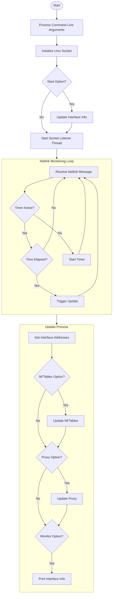

# IPMon - IP Address Monitor

IPMon is a network interface monitor that tracks IP address changes and automatically updates various network services configurations. It supports both IPv4 and IPv6 addresses and provides real-time updates to NFTables rules and proxy configurations.

## Features

- Real-time monitoring of IPv4 and IPv6 address changes
- Automatic NFTables rule updates with named sets support
- Proxy configuration management
- Atomic file updates
- Configurable update delay with debouncing
- Thread-safe operation
- Graceful error handling
- Comprehensive logging

## Architecture



## Prerequisites

Required packages:
```bash
sudo apt install libnftables-dev libjsoncpp-dev clang cmake pkg-config build-essential
```

## Building

### Using CMake
```bash
mkdir build && cd build
cmake ..
cmake --build .
```

### Building Debian Package
```bash
mkdir build && cd build
cmake ..
cmake --build .
cpack
```

## Installation

### From Package (Recommended)
```bash
sudo dpkg -i ipmon_<version>_amd64.deb
```

### From Source
```bash
mkdir build && cd build
cmake ..
cmake --build .
sudo cmake --install .
```

## Usage

Basic command syntax:
```bash
ipmon [-n[FILE] | --nftables[=FILE] [-f | --flush]] [-p[FILE] | --proxy[=FILE]]
      [-d DELAY | --delay=DELAY] [-m | --monitor] [-h | --help]
      [-s | --start]
```

Options:
- `-h, --help`: Display help message
- `-n, --nftables`: Update NFTables addresses
- `-f, --flush`: Flush and reload NFTables ruleset
- `-p, --proxy`: Update proxy configuration
- `-d, --delay`: Set update delay (1-99 seconds or 100-999999 microseconds)
- `-m, --monitor`: Enable monitoring mode
- `-s, --start`: Update addresses at startup

### Example Usage

Monitor and update NFTables with flush:
```bash
ipmon -n --flush
```

Monitor and update proxy with custom delay:
```bash
ipmon -p --delay=500000
```

Monitor all services with debugging:
```bash
ipmon -n -p -m --start
```

## Configuration Files

Default configuration directory:
- `/etc/impon`

### NFTables Configuration

Two configuration files are maintained:

1. Variables file (`/etc/ipmon/ifacesAddrs.vars`):
```nft
#!/usr/sbin/nft -f
define enp0s3 = { 192.168.150.52 }
define enp0s8 = { 192.168.56.2, 192.168.56.3 }
```

2. Sets file (`/etc/ipmon/ifacesAddrs.sets`):
```nft
#!/usr/sbin/nft -f
set enp0s3_ipv4_address { type ipv4_addr; elements = { 192.168.150.52 } }
set enp0s8_ipv4_address { type ipv4_addr; elements = { 192.168.56.2 } }
```

## Service Integration

IPMon integrates with system services through:
- Systemd service management
- Unix domain sockets located at `/run/ipmon.sock` for IPC
- Atomic file updates
- Service-specific configuration formats

## Troubleshooting

Common issues:

1. Service Updates Failing
   - Verify root privileges
   - Check service status: `systemctl status ipmon`
   - Review logs: `journalctl -u ipmon`

2. Address Updates Not Detected
   - Verify netlink socket status
   - Check interface status: `ip addr`
   - Enable monitoring: `ipmon -m`

3. Permission Issues
   - Check file permissions in `/etc/ipmon/`
   - Verify socket permissions in `/run/ipmon.sock`

## Development

The project uses modern C++20 features and follows these practices:
- RAII for resource management
- Thread-safe operations
- Exception-safe code
- Comprehensive error handling
- Atomic operations for file updates

### Building Debug Version
```bash
mkdir build-debug && cd build-debug
cmake -DCMAKE_BUILD_TYPE=Debug ..
cmake --build .
```
## License

This project is licensed under the GNU General Public License v3.0 (GPL-3.0).

Read more at [LICENSE](./LICENSE.md).
